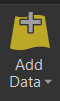
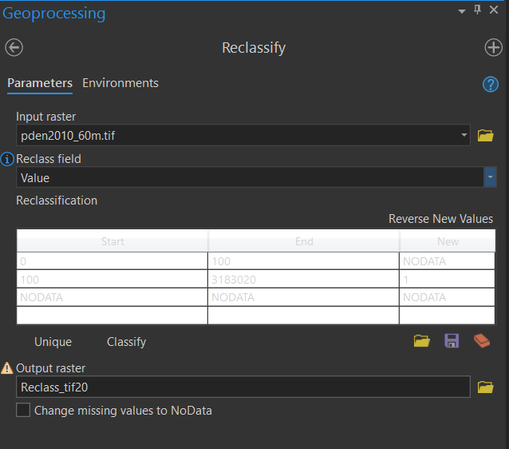
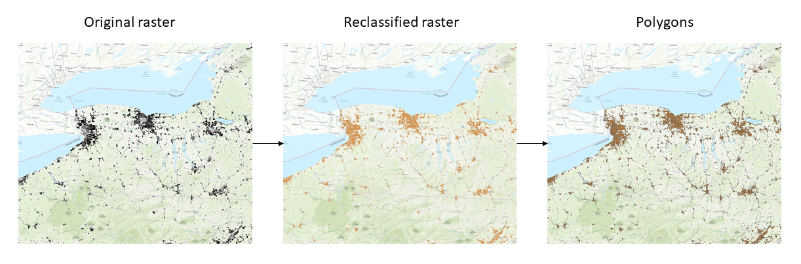

# Converting raster to polygon in ArcGIS

- Unzip the data (if zipped);
- Run ArcGIS;
- Load the raster from the Map tab: 

	*  Add Data -> Browse to the raster file -> Add the .tif file (or other raster format) for the Raster Datasets;
	
- Get the relevant raster grids:

  

	* using Reclassify with 2 classes: VALUE >= 100 = 1; VALUE < 100 = NODATA;

	* if we want to map Raster instead, use Extract by Attributes with this condition: VALUE > 100;

- Then use Raster to Polygon conversion on the reclassified raster.

